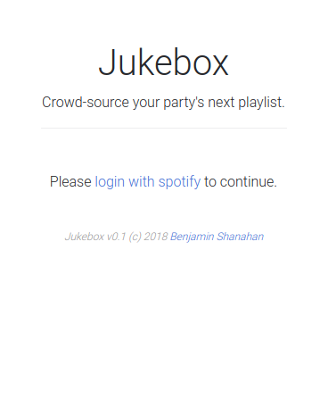
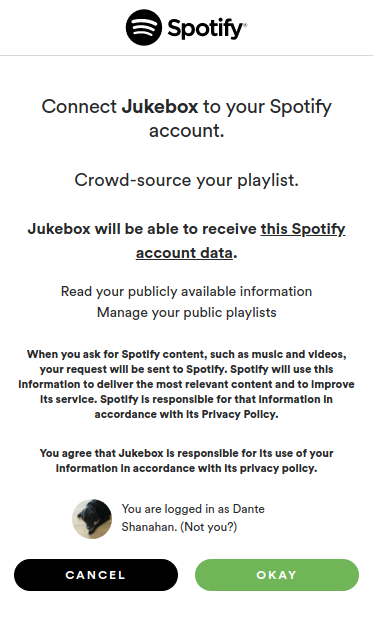
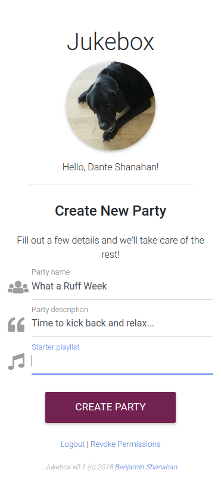
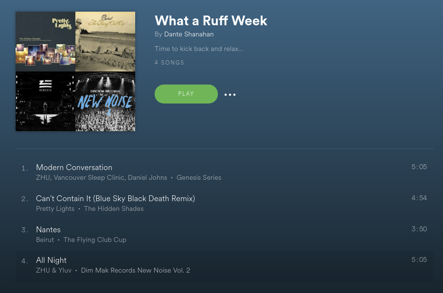

# Jukebox

Crowd-source the playlist for your next party.

## Installation

    $ sudo pip3 install config/requirements.txt
    $ cp config/app.cfg.generic config/app.cfg

Then modify the contents of 'config/app.cfg' to match your Spotify Client ID and secret. Obtain these [here](https://developer.spotify.com/my-applications/).

You must also the following **Redirect URI** in your Spotify App console, verbatim: `http://127.0.0.1:5000/callback`

Once everything is installed and configured, run:
    
    $ python3 app.py

And open your web browser to [http://127.0.0.1:5000/](http://127.0.0.1:5000/).

## Screenshots

